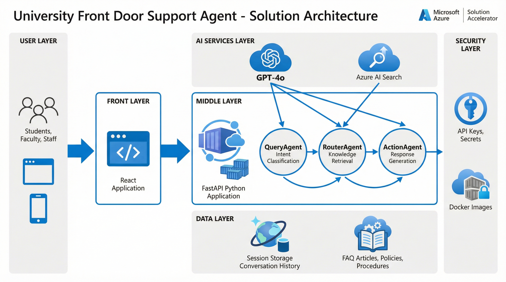

# University Front Door Support Agent

[](https://portal.azure.com/#create/Microsoft.Template/uri/https%3A%2F%2Fraw.githubusercontent.com%2Fmsftsean%2Fhiedcab_frontdoor_agent%2Fmain%2Finfra%2Fazuredeploy.json)

[](https://python.org)
[](https://fastapi.tiangolo.com)
[](https://react.dev)
[](https://typescriptlang.org)
[](https://azure.microsoft.com)
[](LICENSE)

> **Eliminate the "47 Front Doors" Problem** - A three-agent AI system that provides a single, intelligent entry point for university student support.

---

## Overview

The **Universal Front Door Support Agent** is a three-agent AI system that provides a single, intelligent entry point for all university student support requests. Instead of navigating multiple disconnected support channels, students interact with one interface that:

- **Detects intent** from natural language queries
- **Routes requests** to the correct department
- **Creates tickets** automatically in ServiceNow
- **Retrieves knowledge** articles for self-service
- **Escalates to humans** for policy-related requests

**Target Impact**: Increase first-contact resolution from **40%** to **65%**

### Solution Architecture



---

## Quick Start

### Prerequisites

- Python 3.11+
- Node.js 18+
- Docker (optional)

### Option 1: Local Development (Recommended)

```bash
# Clone repository
git clone https://github.com/msftsean/hiedcab_frontdoor_agent.git
cd hiedcab_frontdoor_agent

# Backend setup
cd backend
python -m venv .venv
source .venv/bin/activate  # Windows: .venv\Scripts\activate
pip install -r requirements.txt
cp .env.example .env
uvicorn app.main:app --reload --port 8000

# Frontend setup (new terminal)
cd frontend
npm install
cp .env.example .env
npm run dev
```

| Service | URL |
|---------|-----|
| Frontend | http://localhost:5173 |
| Backend API | http://localhost:8000 |
| API Docs | http://localhost:8000/docs |
| Health Check | http://localhost:8000/api/health |

### Option 2: Docker Compose

```bash
docker-compose up --build
```

| Service | URL |
|---------|-----|
| Frontend | http://localhost:3000 |
| Backend | http://localhost:8000 |

---

## Architecture

### Three-Agent Conversation Flow


The three-agent system processes each user query through a coordinated pipeline:

1. **QueryAgent** - Classifies intent (financial aid, registration, housing, technical support, general)
2. **RouterAgent** - Searches Azure AI Search for relevant KB articles
3. **ActionAgent** - Generates contextual responses and determines if a support ticket is needed

### Azure Infrastructure


| Service | Purpose |
|---------|---------|
| Azure OpenAI | Intent classification, response generation |
| Container Apps | Backend API hosting |
| Static Web Apps | Frontend hosting |
| Cosmos DB | Session and audit storage |
| AI Search | Knowledge base search |
| Key Vault | Secrets management |

---

## Azure Deployment

### Supported Regions

Deploy to regions with GPT-4o availability:

| Region | GPT-4o | GPT-4o-mini |
|--------|:------:|:-----------:|
| East US | Yes | Yes |
| East US 2 | Yes | Yes |
| West US 3 | Yes | Yes |
| UK South | Yes | Yes |
| Sweden Central | Yes | Yes |

### Deploy with Azure Developer CLI

```bash
# Login to Azure
azd auth login

# Initialize and deploy
azd init
azd up
```

### Cost Estimates


| Scale | Users | Monthly Cost |
|-------|------:|-------------:|
| Development | 1-10 | $50-100 |
| Small Pilot | 100-500 | $160-305 |
| Medium | 500-2,000 | $400-700 |
| Production | 2,000-10,000 | $1,000-2,500 |

See [Cost Estimation Guide](./docs/deployment/COST_ESTIMATION.md) for details.

---

## API Reference

| Method | Endpoint | Description |
|--------|----------|-------------|
| `POST` | `/api/chat` | Submit support query |
| `GET` | `/api/health` | Health check |
| `GET` | `/api/session/{id}` | Get session |
| `DELETE` | `/api/session/{id}` | End session |

### POST /api/chat

**Request:**
```json
{
  "message": "I forgot my password",
  "session_id": null
}
```

**Response:**
```json
{
  "session_id": "550e8400-e29b-41d4-a716-446655440000",
  "ticket_id": "TKT-IT-20260121-0001",
  "department": "IT",
  "status": "created",
  "message": "I've created a ticket for IT Support...",
  "knowledge_articles": [
    {
      "title": "How to Reset Your Password",
      "url": "https://kb.university.edu/password-reset",
      "relevance_score": 0.94
    }
  ],
  "escalated": false,
  "estimated_response_time": "2 hours"
}
```

---

## Testing

### Backend

```bash
cd backend
source .venv/bin/activate
pytest                           # Run all tests
pytest --cov=app --cov-report=html  # With coverage
```

### Frontend

```bash
cd frontend
npm test          # Unit tests
npm run test:e2e  # E2E tests
```

---

## Documentation

| Document | Description |
|----------|-------------|
| [Feature Spec](./docs/specs/spec.md) | Detailed requirements |
| [Data Model](./docs/specs/data-model.md) | Schema definitions |
| [Implementation Plan](./docs/specs/plan.md) | Development roadmap |
| [Customization Guide](./docs/customization/CUSTOMIZATION.md) | Hands-on customization lab |
| [Sample Customizations](./docs/customization/SAMPLE_CUSTOMIZATIONS.md) | Ready-to-use examples |
| [Cost Estimation](./docs/deployment/COST_ESTIMATION.md) | Detailed pricing |

---

## Project Structure

```
hiedcab_frontdoor_agent/
├── backend/           # FastAPI Python backend
│   ├── app/
│   │   ├── agents/   # QueryAgent, RouterAgent, ActionAgent
│   │   ├── api/      # REST endpoints
│   │   ├── models/   # Pydantic schemas
│   │   └── services/ # Azure integrations
│   └── tests/
├── frontend/          # React TypeScript frontend
│   ├── src/
│   │   ├── components/
│   │   └── services/
│   └── tests/
├── docs/              # Documentation
│   ├── architecture/ # Diagrams
│   ├── customization/
│   ├── deployment/
│   └── specs/        # Feature specifications
├── infra/             # Azure Bicep templates
├── docker-compose.yml
└── azure.yaml
```

---

## Contributing

1. Fork the repository
2. Create a feature branch (`git checkout -b feature/amazing-feature`)
3. Commit your changes (`git commit -m 'Add amazing feature'`)
4. Push to the branch (`git push origin feature/amazing-feature`)
5. Open a Pull Request

---

## License

This project is licensed under the MIT License - see the [LICENSE](LICENSE) file for details.

---

<p align="center">
  Built with Azure AI for Higher Education
</p>
