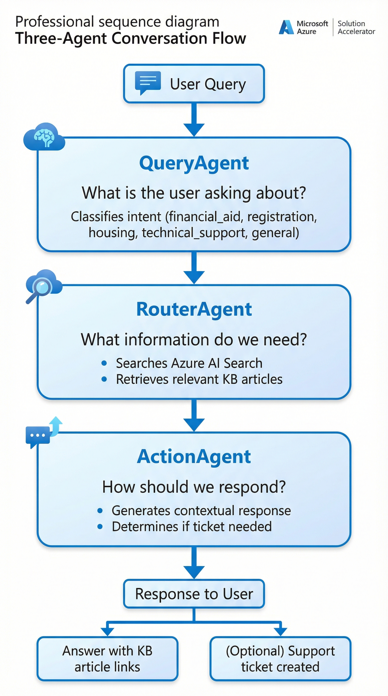
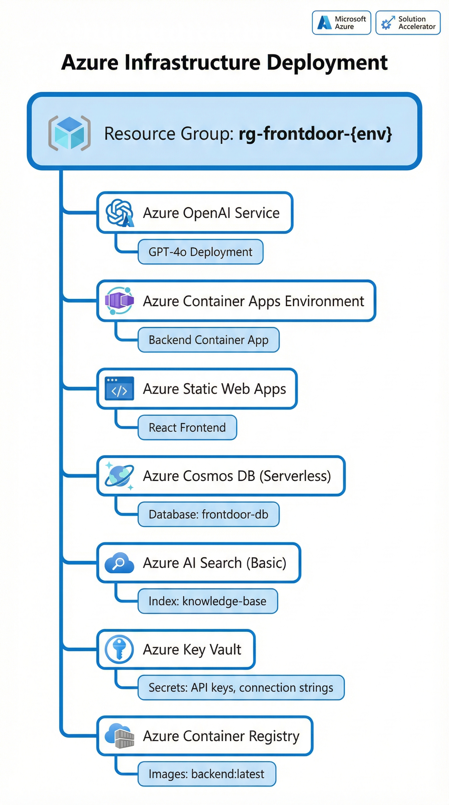
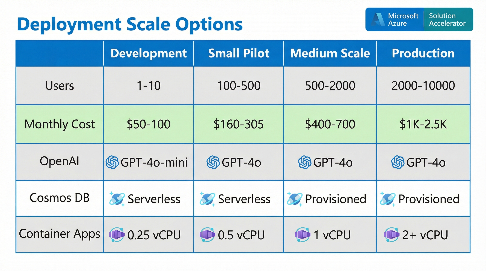

# 🎓 University Front Door Support Agent - Solution Accelerator

[](https://portal.azure.com/#create/Microsoft.Template/uri/https%3A%2F%2Fraw.githubusercontent.com%2Fmsftsean%2Fhiedcab_frontdoor_agent%2Fmain%2Ffront-door%2Faccelerator%2Finfra%2Fazuredeploy.json)

[](./CHANGELOG.md)
[](https://azure.microsoft.com)
[](../LICENSE)
[](../CONTRIBUTING.md)

> 🚀 **Eliminate the "47 Front Doors" Problem** - A three-agent AI system that provides a single, intelligent entry point for university student support.

---

## 📊 Implementation Status

```
Documentation       ████████████████████ 100% ✅
Infrastructure      ████████████████████ 100% ✅
Deployment Scripts  ████████████████░░░░  80% 🔄
Sample Data         ████████████████████ 100% ✅
Testing Framework   ██████████████░░░░░░  70% 🔄
```

---

## 🌟 Overview

The **University Front Door Support Agent** is a solution accelerator that enables higher education institutions to deploy an AI-powered support system in their own Azure environment.

### ✨ Key Capabilities

| Capability | Description | Status |
|------------|-------------|:------:|
| 🎯 Intent Detection | Natural language understanding of student queries | ✅ |
| 🔀 Smart Routing | Automatic routing to correct department | ✅ |
| 🎫 Ticket Creation | Auto-create tickets in your ticketing system | ✅ |
| 📚 Knowledge Retrieval | Surface relevant KB articles | ✅ |
| 👤 Human Escalation | Policy requests go to humans | ✅ |
| 🔒 PII Protection | Sensitive data flagged and protected | ✅ |

**🎯 Target Impact**: Increase first-contact resolution from **40%** to **65%**

### 🏛️ Solution Architecture


*The solution architecture spans five layers: User Layer (students, faculty, staff accessing via web/mobile), Front Layer (React application), Middle Layer (FastAPI with three AI agents), AI Services Layer (GPT-4o and Azure AI Search), and Data Layer (session storage and knowledge base), all secured by Azure Key Vault and Container Registry.*

---

## 📋 Version Matrix

### 🔧 Runtime Requirements

| Component | Minimum | Recommended | Tested | Status |
|-----------|:-------:|:-----------:|:------:|:------:|
| 🐍 Python | 3.11 | 3.12 | 3.11.7 | ✅ |
| 📦 Node.js | 18.0 | 20.0 | 20.10.0 | ✅ |
| 🐳 Docker | 24.0 | 25.0 | 25.0.3 | ✅ |
| ☁️ Azure CLI | 2.50 | 2.60 | 2.58.0 | ✅ |
| 🚀 Azure Developer CLI | 1.18.0 | 1.20.0 | 1.19.0 | ✅ |

### ☁️ Azure Service Versions

| Service | API Version | SKU | Status |
|---------|:-----------:|:---:|:------:|
| 🤖 Azure OpenAI | 2024-05-01-preview | Standard | ✅ |
| 🗄️ Cosmos DB | 2023-11-15 | Serverless | ✅ |
| 🔍 AI Search | 2024-03-01-preview | Basic+ | ✅ |
| 📦 Container Apps | 2023-08-01-preview | Consumption | ✅ |
| 🌐 Static Web Apps | 2022-09-01 | Free/Standard | ✅ |
| 🔐 Key Vault | 2023-07-01 | Standard | ✅ |

### 🌐 Browser Support

| Browser | Minimum | Status |
|---------|:-------:|:------:|
| 🌐 Chrome | 90+ | ✅ |
| 🦊 Firefox | 90+ | ✅ |
| 🧭 Safari | 14+ | ✅ |
| 📘 Edge | 90+ | ✅ |

---

## 🚀 Quick Deploy

### 📋 Prerequisites

| Requirement | Details | Check |
|-------------|---------|:-----:|
| ☁️ Azure Subscription | With permissions to create resources | ⬜ |
| 🔧 Azure CLI | Version 2.50+ | ⬜ |
| 🚀 Azure Developer CLI (azd) | Version 1.18.0+ ([Install](https://learn.microsoft.com/azure/developer/azure-developer-cli/install-azd)) | ⬜ |
| 📦 Node.js | 18+ | ⬜ |
| 🐍 Python | 3.11+ | ⬜ |

### 🌍 Supported Regions

This accelerator deploys Azure OpenAI resources. Deploy to regions with GPT-4o availability:

| Region | GPT-4o | GPT-4o-mini | Status |
|--------|:------:|:-----------:|:------:|
| 🇺🇸 East US | ✅ | ✅ | Recommended |
| 🇺🇸 East US 2 | ✅ | ✅ | ✅ |
| 🇺🇸 West US 3 | ✅ | ✅ | ✅ |
| 🇬🇧 UK South | ✅ | ✅ | ✅ |
| 🇸🇪 Sweden Central | ✅ | ✅ | ✅ |
| 🇯🇵 Japan East | ✅ | ✅ | ✅ |

---

### ⚡ Option 1: One-Click Deploy (Azure Portal)

Click the **Deploy to Azure** button at the top of this page to launch the deployment wizard.

```
Deployment Progress:
[1] Resource Group    ████████████████████ Creating...
[2] Azure OpenAI      ░░░░░░░░░░░░░░░░░░░░ Pending
[3] Cosmos DB         ░░░░░░░░░░░░░░░░░░░░ Pending
[4] AI Search         ░░░░░░░░░░░░░░░░░░░░ Pending
[5] Container Apps    ░░░░░░░░░░░░░░░░░░░░ Pending
[6] Application       ░░░░░░░░░░░░░░░░░░░░ Pending
```

### 🛠️ Option 2: Azure Developer CLI (Recommended)

```bash
# 📥 Clone the repository
git clone https://github.com/msftsean/hiedcab_frontdoor_agent.git
cd hiedcab_frontdoor_agent/front-door

# 🔐 Login to Azure
azd auth login

# 🚀 Initialize and deploy
azd init
azd up
```

**Deployment Steps**:
```
✅ Step 1: Authenticate with Azure
✅ Step 2: Select subscription
✅ Step 3: Choose region
⏳ Step 4: Provision infrastructure (~10 min)
⏳ Step 5: Deploy application (~5 min)
⏳ Step 6: Configure services
🎉 Complete!
```

### 💻 Option 3: GitHub Codespaces

[](https://codespaces.new/msftsean/hiedcab_frontdoor_agent)

1. ☝️ Click the badge above to launch a Codespace
2. ⏳ Wait for the environment to initialize (~2 min)
3. 🚀 Run `azd up` in the terminal

### 🐳 Option 4: Local Development with Docker

```bash
# 📥 Clone repository
git clone https://github.com/msftsean/hiedcab_frontdoor_agent.git
cd hiedcab_frontdoor_agent/front-door

# 🐳 Start with Docker Compose (mock mode)
docker-compose up --build

# ✅ Access the application
# 🖥️ Frontend: http://localhost:3000
# ⚙️ Backend: http://localhost:8000
# 📚 API Docs: http://localhost:8000/docs
```

---

## 🏗️ Architecture

### 🔄 Three-Agent Conversation Flow



*The three-agent system processes each user query through a coordinated pipeline: **QueryAgent** classifies intent (financial aid, registration, housing, technical support, general), **RouterAgent** searches Azure AI Search for relevant KB articles, and **ActionAgent** generates contextual responses and determines if a support ticket is needed.*

### 🏗️ Azure Infrastructure



*All resources are deployed within a single resource group (`rg-frontdoor-{env}`), including Azure OpenAI Service with GPT-4o, Container Apps for the backend, Static Web Apps for the React frontend, Cosmos DB (Serverless) for session storage, AI Search for the knowledge base, Key Vault for secrets, and Container Registry for Docker images.*

### ☁️ Azure Services Used

| Service | Purpose | SKU | Monthly Cost |
|---------|---------|:---:|-------------:|
| 🤖 Azure OpenAI | Intent classification, response generation | Standard | $50-150 |
| 📦 Container Apps | Backend API hosting | Consumption | $20-50 |
| 🌐 Static Web Apps | Frontend hosting | Free/Standard | $0-9 |
| 🗄️ Cosmos DB | Session and audit storage | Serverless | $10-25 |
| 🔍 AI Search | Knowledge base search | Basic | $75 |
| 🔐 Key Vault | Secrets management | Standard | <$5 |
| 📦 Container Registry | Container images | Basic | $5 |

---

## 💰 Cost Estimate

### 📊 Deployment Scale Options



*Choose your deployment scale based on user count: Development (1-10 users, GPT-4o-mini, $50-100/mo), Small Pilot (100-500 users, GPT-4o, $160-305/mo), Medium Scale (500-2000 users, provisioned Cosmos DB, $400-700/mo), or Production (2000-10000 users, 2+ vCPU, $1K-2.5K/mo).*

### 📋 Monthly Cost Summary

| Scale | Users | Monthly Cost | Status |
|-------|------:|-------------:|:------:|
| 🧪 Development | 1-10 | $50-100 | ✅ Ready |
| 🚀 Small Pilot | 100-500 | $160-305 | ✅ Ready |
| 📈 Medium | 500-2,000 | $400-700 | ✅ Ready |
| 🏢 Production | 2,000-10,000 | $1,000-2,500 | ✅ Ready |

```
Cost Breakdown (Small Pilot - 500 users):

Azure OpenAI     ████████████░░░░░░░░  $50-150  (45%)
AI Search        ██████████░░░░░░░░░░  $75      (25%)
Container Apps   ████░░░░░░░░░░░░░░░░  $20-50   (15%)
Cosmos DB        ███░░░░░░░░░░░░░░░░░  $10-25   (8%)
Other            ██░░░░░░░░░░░░░░░░░░  $15      (7%)
─────────────────────────────────────────────────
Total                                  $170-315
```

📊 Use the [Azure Pricing Calculator](https://azure.microsoft.com/pricing/calculator/) for detailed estimates.

📄 See full details: **[Cost Estimation Guide](./docs/COST_ESTIMATION.md)**

---

## ✅ Post-Deployment Setup

### 🔧 Setup Checklist

| Step | Task | Time | Status |
|:----:|------|:----:|:------:|
| 1️⃣ | Verify Health Check | 1 min | ⬜ |
| 2️⃣ | Configure SSO (Optional) | 30 min | ⬜ |
| 3️⃣ | Import Knowledge Base | 1-2 hrs | ⬜ |
| 4️⃣ | Connect ServiceNow (Optional) | 1 hr | ⬜ |
| 5️⃣ | Customize Branding | 30 min | ⬜ |
| 6️⃣ | Test End-to-End | 30 min | ⬜ |

### 1️⃣ Verify Health Check

```bash
# ✅ Check that all services are running
curl https://your-app.azurecontainerapps.io/api/health

# Expected response:
# {
#   "status": "healthy",
#   "services": {
#     "llm": {"status": "up", "latency_ms": 150},
#     "ticketing": {"status": "up"},
#     "knowledge_base": {"status": "up"}
#   }
# }
```

### 2️⃣ Configure SSO (Optional)

Update environment variables in Azure Container Apps:
- `SSO_ISSUER`: Your identity provider URL
- `SSO_AUDIENCE`: Application client ID

### 3️⃣ Import Knowledge Base

```bash
# Navigate to Azure AI Search in the portal
# Create an index named 'knowledge-articles'
# Import your university's KB content
```

### 4️⃣ Connect ServiceNow (Optional)

Update secrets in Key Vault:
- `servicenow-instance`
- `servicenow-client-id`
- `servicenow-client-secret`

---

## 🎨 Customization Guide

Ready to customize for your institution? See our comprehensive guides:

| Guide | Description | Time |
|-------|-------------|:----:|
| 📖 **[Customization Guide](./docs/CUSTOMIZATION.md)** | Complete hands-on lab guide | 2-4 hrs |
| 🎯 **[Sample Customizations](./docs/SAMPLE_CUSTOMIZATIONS.md)** | Ready-to-use examples | 30 min |
| 💰 **[Cost Estimation](./docs/COST_ESTIMATION.md)** | Detailed pricing guide | 15 min |

### ⚡ Quick Customizations

| Customization | File/Location | Difficulty | Time |
|--------------|---------------|:----------:|:----:|
| 🎨 University branding | `frontend/src/components/Header.tsx` | 🟢 Easy | 5 min |
| 🎨 Brand colors | `frontend/tailwind.config.js` | 🟢 Easy | 5 min |
| 💬 Welcome message | `frontend/src/App.tsx` | 🟢 Easy | 5 min |
| 🏢 Department routing | `backend/app/agents/router_agent.py` | 🟡 Medium | 30 min |
| 🤖 Intent prompts | `backend/app/services/azure/llm_service.py` | 🟡 Medium | 1 hr |
| 📚 Knowledge base | Azure AI Search index | 🟢 Easy | 1-2 hrs |
| ⏱️ SLA response times | `backend/app/core/config.py` | 🟢 Easy | 10 min |
| 🚨 Escalation keywords | `backend/app/services/azure/llm_service.py` | 🟢 Easy | 15 min |

---

## 🔒 Security Considerations

### ✅ Security Checklist

| Feature | Implementation | Status |
|---------|---------------|:------:|
| 🔐 Managed Identity | All Azure service connections | ✅ |
| 🔑 Key Vault | Secrets stored securely | ✅ |
| 🛡️ PII Protection | Sensitive data not logged | ✅ |
| 🌐 CORS | Configured for your domain | ✅ |
| ⚡ Rate Limiting | Built-in throttling | ✅ |
| 📝 Audit Logging | All interactions logged | ✅ |

### 📋 Compliance Notes

- ⚙️ Configure for your institution's data residency requirements
- 📜 Review FERPA compliance considerations in your deployment
- 📊 Enable diagnostic logging for audit requirements

---

## 📚 Related Resources

### 📖 Documentation

| Resource | Description |
|----------|-------------|
| 📋 [Project README](../README.md) | Full project documentation |
| 🔌 [API Reference](../README.md#-api-reference) | REST API documentation |
| 🧪 [Testing Guide](../README.md#-testing) | Test suites and coverage |
| 📜 [Specification](../specs/1-front-door-agent/spec.md) | Detailed requirements |

### 🔗 Similar Accelerators

| Accelerator | Description |
|-------------|-------------|
| 🤖 [Multi-Agent Automation Engine](https://github.com/msftsean/Multi-Agent-Custom-Automation-Engine-Solution-Accelerator) | Enterprise automation |
| ☁️ [Azure OpenAI Accelerators](https://accelerators.ms) | More AI accelerators |

---

## 🆘 Support

| Channel | Link |
|---------|------|
| 🐛 Issues | [GitHub Issues](https://github.com/msftsean/hiedcab_frontdoor_agent/issues) |
| 💬 Discussions | [GitHub Discussions](https://github.com/msftsean/hiedcab_frontdoor_agent/discussions) |
| 📧 Email | support@university.edu |

---

## ⚠️ Disclaimer

This solution accelerator is provided "as-is" without warranty. It is intended as a starting point for building AI-powered support systems.

| Consideration | Recommendation |
|---------------|----------------|
| 🤖 AI Responses | Review for accuracy before production |
| 🚨 Escalation Rules | Configure for your institution's policies |
| 📋 Data Governance | Ensure compliance with your requirements |
| 🧪 Testing | Thoroughly test before production deployment |

---

<p align="center">
  🎓 Built with ❤️ and Azure AI for Higher Education
</p>

<p align="center">
  <a href="https://azure.microsoft.com">
    
  </a>
</p>
